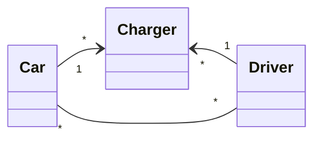
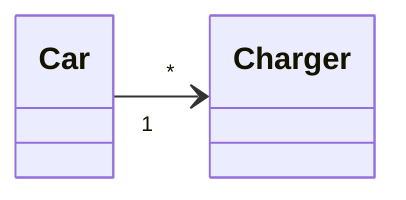
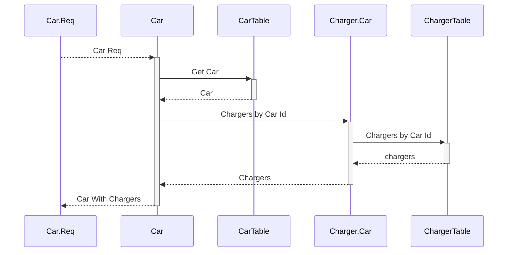
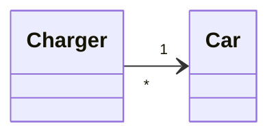
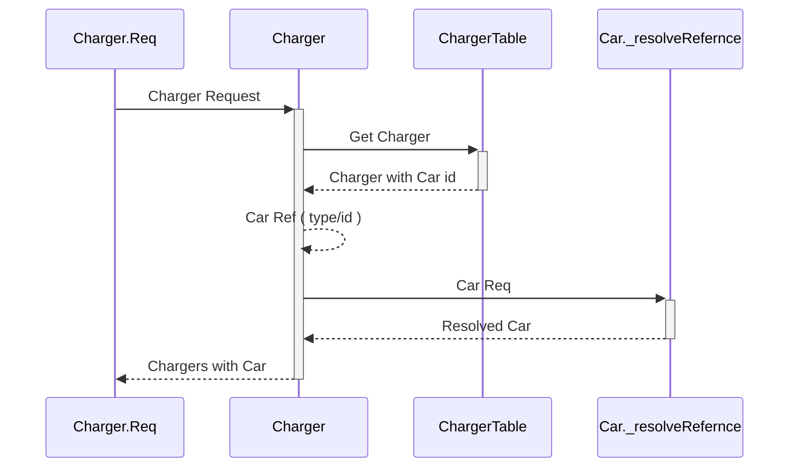
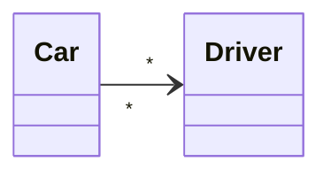
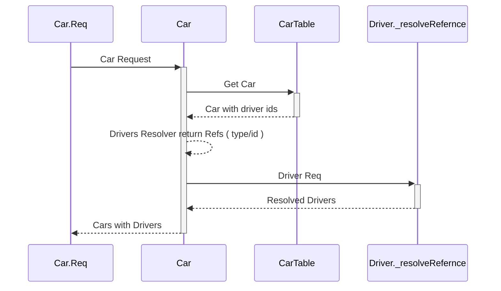

<!--
title: 'AWS Simple HTTP Endpoint example in NodeJS'
description: 'This template demonstrates how to make a simple HTTP API with Node.js running on AWS Lambda and API Gateway using the Serverless Framework.'
layout: Doc
framework: v3
platform: AWS
language: nodeJS
authorLink: 'https://github.com/serverless'
authorName: 'Serverless, inc.'
authorAvatar: 'https://avatars1.githubusercontent.com/u/13742415?s=200&v=4'
-->
# GRAPHQL FEDERATIONS

## Relationships

### Model



### One to Many
1. Charger 1 - * Car 




### Logging
1. 
```
- ------------------------- CAR REQ {
  "query": "query ONE_TO_MANY_CAR_CHARGERS__cars__0($ids:[ID]){cars(ids:$ids){__typename id name registrationNumber}}",
  "variables": {
  "ids": [
  "1"
  ]
  },
  "operationName": "ONE_TO_MANY_CAR_CHARGERS__cars__0"
  }

```
2. ------------------------- CAR - CARS
3. 
```
- ------------------------- CHARGER REQ {
  "query": "query ONE_TO_MANY_CAR_CHARGERS__chargers__1($representations:[_Any!]!){_entities(representations:$representations){...on Car{chargers{id productName}}}}",
  "variables": {
  "representations": [
  {
  "__typename": "Car",
  "id": "1"
  }
  ]
  },
  "operationName": "ONE_TO_MANY_CAR_CHARGERS__chargers__1
  }

```
4. - 2 ----------------------- CHARGER -> CAR - CHARGERS 1

### Many to One
1. Car *  - 1 Charger 




### Logging
1. ```
   ------------------------- CHARGER REQ {
    "query": "query MANY_TO_ONE_CAR_CHARGER__chargers__0($ids:[ID]){chargers(ids:$ids){id productName car{__typename id}}}",
    "variables": {
    "ids": [
    "1"
    ]
    },
    "operationName": "MANY_TO_ONE_CAR_CHARGER__chargers__0"
    }

2. ----------------------- CHARGER - CHARGERS
3. ------------------------- CHARGER - CAR 1
4. 
``` 
  ------------------------- CAR REQ {
    "query": "query MANY_TO_ONE_CAR_CHARGER__cars__1($representations:[_Any!]!){_entities(representations:$representations){...on Car{registrationNumber}}}",
    "variables": {
    "representations": [
    {
    "__typename": "Car",
    "id": "1"
    }
    ]
    },
    "operationName": "MANY_TO_ONE_CAR_CHARGER__cars__1"
  } 
  ```
5.  ####### Resolve Car { __typename: 'Car', id: '1' }

### Many to Many 
1. Car *  - * Driver 




### Logging
1. 
```
   - ------------------------- CAR REQ {
  "query": "query MANY_TO_MANY_CAR_DRIVER__cars__0($ids:[ID]){cars(ids:$ids){id name registrationNumber drivers{__typename id}}}",
  "variables": {
  "ids": [
  "1"
  ]
  },
  "operationName": "MANY_TO_MANY_CAR_DRIVER__cars__0"
  }
```

2. ------------------------- CAR - CARS
3. ------------------------- CAR - DRIVERS
4.
``` 
  - ------------------------- DRIVER REQ {
  "query": "query MANY_TO_MANY_CAR_DRIVER__drivers__1($representations:[_Any!]!){_entities(representations:$representations){...on Driver{email}}}",
  "variables": {
    "representations": [
      {
        "__typename": "Driver",
        "id": "1"
      },
      {
        "__typename": "Driver",
        "id": "2"
      }
    ]
  },
  "operationName": "MANY_TO_MANY_CAR_DRIVER__drivers__1"
}

  ```
5.  ####### Resolve Drivers { __typename: 'Driver', id: '1' }
6.  ####### Resolve Drivers { __typename: 'Driver', id: '2' }
7. !!!!!!!!!!! load drivers [ '1', '2' ] -- Dataloader
